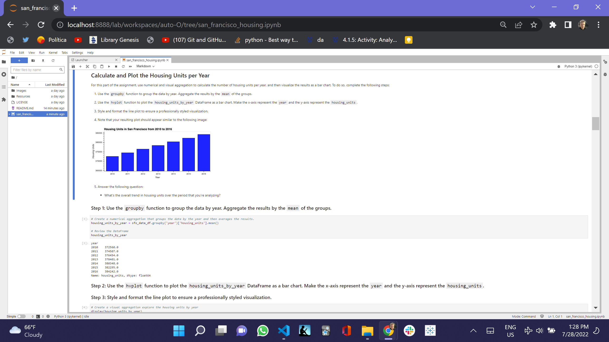

# Data visualization skills, including aggregation, interactive visualizations, and geospatial analysis, to find properties in the San Francisco market that are viable investment opportunities

In this Challenge, I am analyst for Proptech, a company that wants to offer an instant, one-click service for people to buy properties and then rent them. The company wants to have a trial of this offering in the San Francisco real-estate market. If the service proves popular, they can then expand to other markets.

My job is to use data visualization skills, including aggregation, interactive visualizations, and geospatial analysis, to find properties in the San Francisco market that are viable investment opportunities, using HoloViews, designed to making data analysis and visualzation easy.

## Technologies

This was developed with Anaconda, which includes Pandas, Matplotlib and Jupyter_Lab and I created it in a development environment running Python 3.7.13.

---

## Installation Guide

Install Anaconda and Python. </br>

Git clone the repo and run it, pursuant to the following clone address

git clone https://github.com/JeffSmith-ok/Module_6_Challenge

cd Module_6_Challenge

In the terminal type 'Jupyter Lab'

---

## Usage

The following images show the notebook read in Juypter Lab and in Github under financial_planning_tools.ipynb.

##  </br>

---

## Contributors

This is the sixth of the individual learning challenges.

My contact information is:

Name: Jeffrey M. Smith </br>
Linkedin: https://www.linkedin.com/in/jeffsmith77/ </br>
Personal email: jmstranslate@gmail.com </br>
Phone: 332 238 5209

---

## License

MIT License

Copyright (c) 2022 Jeffrey M. Smith

Permission is hereby granted, free of charge, to any person obtaining a copy of this software and associated documentation files (the "Software"), to deal in the Software without restriction, including without limitation the rights to use, copy, modify, merge, publish, distribute, sublicense, and/or sell
copies of the Software, and to permit persons to whom the Software is furnished to do so, subject to the following conditions:

The above copyright notice and this permission notice shall be included in all copies or substantial portions of the Software.

THE SOFTWARE IS PROVIDED "AS IS", WITHOUT WARRANTY OF ANY KIND, EXPRESS OR IMPLIED, INCLUDING BUT NOT LIMITED TO THE WARRANTIES OF MERCHANTABILITY, FITNESS FOR A PARTICULAR PURPOSE AND NONINFRINGEMENT. IN NO EVENT SHALL THE AUTHORS OR COPYRIGHT HOLDERS BE LIABLE FOR ANY CLAIM, DAMAGES OR OTHER LIABILITY, WHETHER IN AN ACTION OF CONTRACT, TORT OR OTHERWISE, ARISING FROM, OUT OF OR IN CONNECTION WITH THE SOFTWARE OR THE USE OR OTHER DEALINGS IN THE
SOFTWARE.

```

```
